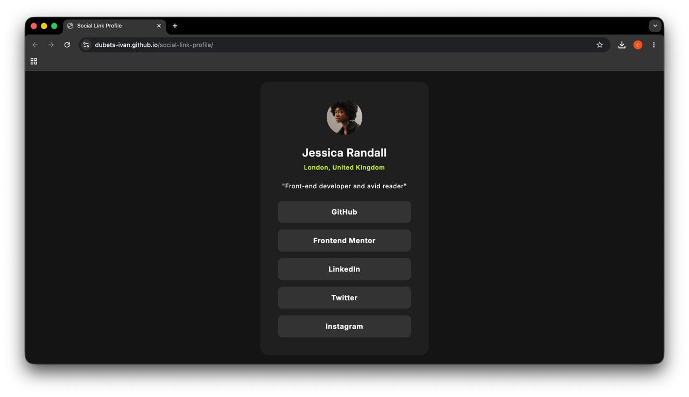
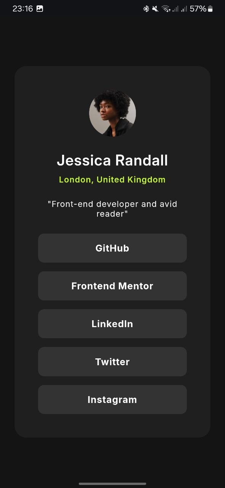

# Frontend Mentor - Social links profile solution

This is a solution to the [Social links profile challenge on Frontend Mentor](https://www.frontendmentor.io/challenges/social-links-profile-UG32l9m6dQ). Frontend Mentor challenges help you improve your coding skills by building realistic projects. 

## Table of contents

- [Overview](#overview)
  - [The challenge](#the-challenge)
  - [Screenshot](#screenshot)
  - [Links](#links)
- [My process](#my-process)
  - [Built with](#built-with)
  - [What I learned](#what-i-learned)
  - [Continued development](#continued-development)
  - [AI Collaboration](#ai-collaboration)
- [Author](#author)

## Overview

### The challenge

Users should be able to:

- See hover and focus states for all interactive elements on the page

### Screenshot




### Links

- Solution URL: [https://github.com/Dubets-Ivan/social-link-profile](https://github.com/Dubets-Ivan/social-link-profile)
- Live Site URL: [https://dubets-ivan.github.io/social-link-profile/](https://dubets-ivan.github.io/social-link-profile/)

## My process

### Built with

- Semantic HTML5 markup
- Pure CSS
- CSS Flexbox
- Responsive Web Design principles
- Google Fonts (Inter)

### What I learned

During this project, I learned the importance of writing semantic HTML and how to properly use CSS for responsive design. Some key takeaways include:

**1. Semantic HTML:** Instead of using `<div>` or `<button>` for navigation links, I learned that an unordered list `<ul>` with anchor tags `<a>` is much better for accessibility and proper document structure.

```html
<ul class="social-links">
    <li><a href="#">GitHub</a></li>
    <li><a href="#">Frontend Mentor</a></li>
</ul>

```

**2. Responsive Layouts:** I discovered the crucial difference between `height` and `min-height`. Using `min-height: 100vh` ensures that the content doesn't get cut off on smaller mobile screens while keeping it perfectly centered on desktop. Furthermore, combining `width: 100%` with `max-width` creates a flexible card component.

```css
main {
    min-height: 100vh;
    display: flex;
    justify-content: center;
    align-items: center;
}

```

### Continued development

In future projects, I want to continue focusing on writing clean, semantic HTML and get more comfortable with advanced CSS layouts. I also plan to improve my daily workflow using Git and the command line to build muscle memory for deployment.

### AI Collaboration

I worked with an AI assistant acting as a mentor during this challenge.

* **How it helped:** The AI guided me through the learning process instead of just providing copy-paste solutions. It helped me understand *why* semantic HTML matters, how to fix a responsive bug using `min-height` instead of `height`, and provided step-by-step instructions on how to use the terminal for Git commands.

## Author

* GitHub - [Dubets-Ivan](https://github.com/Dubets-Ivan)
* Frontend Mentor - [@Dubets-Ivan](https://www.frontendmentor.io/profile/Dubets-Ivan)